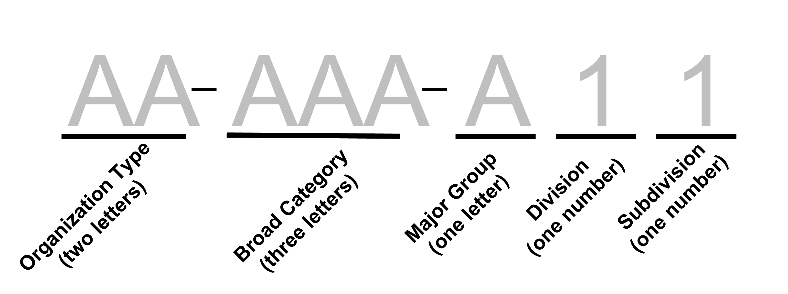

# National Taxonomy of Exempt Entities

## Overview

From: <https://nccs.urban.org/project/national-taxonomy-exempt-entities-ntee-codes>

The National Taxonomy of Exempt Entities (NTEE) system is used by the IRS and NCCS to classify nonprofit organizations. It is also used by the Foundation Center to classify both grants and grant recipients (typically nonprofits or governments). NCCS and the IRS use the NTEE-CC system, described below, while the Foundation Center uses a slightly different version with more codes, as well as "population/beneficiary" codes to indicate the type of population served and "auspice" codes to indicate religious or governmental affiliation.

### Structure of the NTEE-CC

**Major Groups:**

-   I. Arts, Culture, and Humanities - A
-   II\. Education - B
-   III\. Environment and Animals - C, D
-   IV\. Health - E, F, G, H
-   V. Human Services - I, J, K, L, M, N, O, P
-   VI\. International, Foreign Affairs - Q
-   VII\. Public, Societal Benefit - R, S, T, U, V, W
-   VIII\. Religion Related - X
-   IX\. Mutual/Membership Benefit - Y
-   X. Unknown, Unclassified - Z

**Common Codes:**

Common codes represent activities of organizations, such as research, fundraising, and technical assistance, which are common to all major groups. The seven common codes used are:

-   01 Alliance/Advocacy Organizations\

-   02 Management and Technical Assistance\

-   03 Professional Societies/Associations\

-   05 Research Institutes and/or Public Policy Analysis

-   11 Monetary Support - Single Organization\

-   12 Monetary Support - Multiple Organizations\

-   19 Nonmonetary Support Not Elsewhere Classified (N.E.C.)

## Codes

A useful two-page summary of codes:

[download](https://github.com/Nonprofit-Open-Data-Collective/machine_learning_mission_codes/raw/master/docs/assets/NTEE_Two_Page_2005.pdf)

A table of the NTEE codes is available at the National Center for Charitable Statistics:

<https://nccs.urban.org/publication/irs-activity-codes>

For a more friendly format, [dhenderson has created a JSON version](https://github.com/dhenderson/ntee):

[ntee.json](https://raw.githubusercontent.com/Nonprofit-Open-Data-Collective/mission-taxonomies/main/NTEE/ntee.json)

Or you can download the table as a CSV:

[ntee.csv](https://github.com/Nonprofit-Open-Data-Collective/mission-taxonomies/blob/main/NTEE/ntee.csv)

## New NTEE Format

The new NTEE code format is as follows:

1.  Type of organization represented by two letters. The options are:

-   RG - Regular Nonprofit
-   AA - Alliance/Advocacy Organizations
-   MT - Management and Technical Assistance
-   PA - Professional Societies/Associations
-   RP - Research Institutes and/or Public Policy Analysis
-   MS - Monetary Support - Single Organization
-   MM - Monetary Support - Multiple Organizations
-   NS - Nonmonetary Support Not Elsewhere Classified (N.E.C.)

2.  Broad category of the organization represented by three letters. The options are:

-   ART - Arts, Culture, and Humanities
-   EDU - Education
-   ENV - Environment and Animals
-   HEL - Health
-   HMS - Human Services
-   IFA - International, Foreign Affairs
-   PSB - Public, Societal Benefit
-   REL - Religion Related
-   MMB - Mutual/Membership Benefit
-   UNU - Unknown, Unclassified
-   UNI - University
-   HOS - Hospital

3.  Major group, division, and subdivision, represented by three characters where,

-   Major Group: the first character represents the major group (A-Z)
-   Division: the second character represents the division (0, 2-9)
-   Subdivision: the third character represents the subdivision (0-9)

See below how to find the organization type, broad category, major group, division, and subdivisions.

## Intermediary steps

Crosswalk table that includes high-level codes (major groups, minor groups) and the new disaggregated codes.

Definition of disaggregated codes

| Variable Name          | Calculation depend on...                                            | Description                                                                                                                                                                                                                                                                                                                                                                                                                                                                                                                |
|------------------------|---------------------------------------------------------------------|----------------------------------------------------------------------------------------------------------------------------------------------------------------------------------------------------------------------------------------------------------------------------------------------------------------------------------------------------------------------------------------------------------------------------------------------------------------------------------------------------------------------------|
| `old.code`             |                                                                     | Original NTEE Code                                                                                                                                                                                                                                                                                                                                                                                                                                                                                                         |
| `broad.category`       | `major.group`, `old.code`                                           | Value based on "Major Groups" groupings above with the addition of hospitals and universities:  \* 1: ART - A   \* 2: EDU - B (excluding B40, B41, B42, B43, B50)   \* 3: ENV - C, D   \* 4: HEL - E, F, G, H (excluding E20, E21 E22, and E24)   \* 5: HMS - I, J, K, L, M, N, O, P   \* 6: IFA - Q   \* 7: PSB - R, S, T, U, V, W   \* 8: REL - X   \* 9: MMB - Y   \* 10: UNU - Z   \* 11: UNI: codes B40, B41, B42, B43, B50   \* 12: HOS: codes E20, E21 E22, and E24 |
| `major.group`          | letter of `old.code`                                                | A-Z value of "Major Groups"                                                                                                                                                                                                                                                                                                                                                                                                                                                                                                |
| `two.digit`            | `old.code`                                                          | First two digits (2nd and 3rd characters) of original NTEE codes.   Example 1: If `old.code` is A32 then `two.digit` is 32.   Example 2: If `old.code` is A02, then `two.digit` is 02.   Example 2: if `old.code` is A1132 then `two.digit` is 11.                                                                                                                                                                                                                                                             |
| `type.org`             | `two.digit`                                                         | Type.org is \* RG for regular if `two.digit` $>=20$,   \* AA if `two.digit` $=01$,  \* MT if `two.digit` $=02$,   \* PA if `two.digit` $=03$,   \* RP if `two.digit` $=05$,   \* MS if `two.digit` $=11$,   \* MM `two.digit` $=12$,   \* NS `two.digit` $=19$                                                                                                                                                                                                                                 |
| `further.category`     | `old.code`                                                          | Third and fourth digits (fourth and fifth characters) of the original NTEE code if available. If not available, leave this blank.                                                                                                                                                                                                                                                                                                                                                                                          |
| `division.subdivision` | `type.org`, `further.category`                                      |   \* If `type.org` = RG, then `division.subdivision` = `two.digit`,   \* If `type.org` != RG and `further.category` is blank, then `division.subdivision` = 00,   \* If `type.org` != RG and `further.category` is not blank, then `division.subdivision` = `further.category`.                                                                                                                                                                                                                                |
| `new.code`             | `type.org`, `broad.category`, `major.group`, `division.subdivision` | The new code which is formed as one character string of `type.org` - `broad.category` - `major.group` `division.subdivision`                                                                                                                                                                                                                                                                                                                                                                                               |
