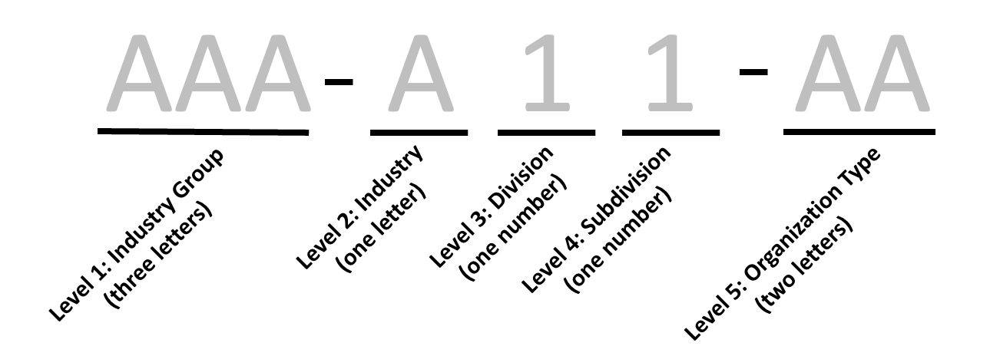
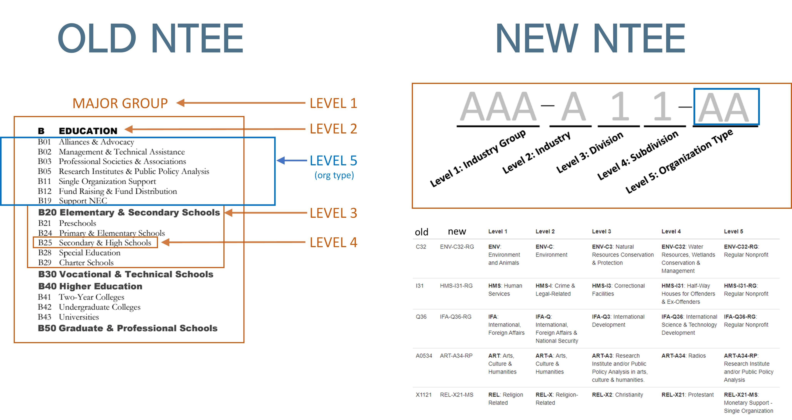

# National Taxonomy of Exempt Entities

## Overview

From: <https://nccs.urban.org/project/national-taxonomy-exempt-entities-ntee-codes>

National Taxonomy of Exempt Entities (NTEE) Code system is used by the
IRS and NCCS to classify nonprofit organizations. It is also used by the
Foundation Center to classify both grants and grant recipients
(typically nonprofits or governments). NCCS and the IRS use the NTEE-CC
system, described below, while the Foundation Center uses a slightly
different version with more codes, as well as "population/beneficiary"
codes to indicate the type of population served and "auspice" codes to
indicate religious or governmental affiliation.

## Original NTEE Structure

Both the structure and the interpretation of an NTEE code varies by the
type of nonprofit it describes, regular or specialty. Most nonprofits
are regular organizations, i.e. ones that are organized and operated for a 
collective, public or social benefit. Some nonprofits are specialty organizations. 
Specialty organizations are those whose primary mission is to provide advocacy, research,
fundraising, and/or technical assistance to separate nonprofit(s).


#### Major Groups 

There are a total of 26 major groups designated by letters A-Z. The 26 major groups and their corresponding letters are:

| NTEE Major Group |	Description|
|------------------|-------------|
|A	| Arts, Culture & Humanities |
|B	| Education |
|C	| Environment |
|D	| Animal-Related |
|E	| Health Care |
|F	| Mental Health & Crisis Intervention |
|G	| Voluntary Health Associations & Medical Disciplines |
|H	| Medical Research |
|I	| Crime & Legal-Related |
|J	| Employment |
|K	| Food, Agriculture & Nutrition |
|L	| Housing & Shelter |
|M	| Public Safety, Disaster Preparedness & Relief |
|N	| Recreation & Sports |
|O	| Youth Development |
|P	| Human Services |
|Q	| International, Foreign Affairs & National Security |
|R	| Civil Rights, Social Action & Advocacy |
|S	| Community Improvement & Capacity Building |
|T	| Philanthropy, Voluntarism & Grantmaking Foundations |
|U	| Science & Technology |
|V	| Social Science |
|W	| Public & Societal Benefit |
|X	| Religion-Related |
|Y	| Mutual & Membership Benefit |
|Z	| Unknown |

####  Regular Nonprofits

Regular nonprofits have NTEE codes with three characters, one letter
followed by two numbers. The letter represents the major group, the
first number represents the division, and the second number represents
the subdivision. 

```
B  EDUCATION¦  
+--  B20 ELEMENTARY AND SECONDARY SCHOOLS
¦ +--B21 Preschools
¦ +--B24 Primary & Elementary Schools
¦ +--B25 Secondary & High Schools
¦ +--B28 Special Education
¦ +--B29 Charter School
```

* Bxx = Major Group 
* B2x = Division 
* B21 = Subdivision

Each major group contains between 1 and 8 divisions, and each division
contains between 1 and 10 subdivisions.

#### Broad Industries 

The NTEE classification system aggregates the 
26 major groups (letters A - Z) into 10 broad
categories (numerals I-X) as follows: 
  
1. I. Arts, Culture, and Humanities (ART) - A 
2. II. Education (EDU) - B, excluding NTEE codes B40, B41, B42, and B43 
3. III. Environment and Animals (ENV) - C, D 
4. IV. Health (HEL) - E, F, G, H
5. V. Human Services(HMS)- I, J, K, L, M, N, O, P 
6. VI. International, Foreign Affairs (IFA) - Q 
7. VII. Public, Societal Benefit (PSB) - R, S, T, U, V, W 
8. VIII. Religion Related (REL) - X 
9. IX. Mutual/Membership Benefit (MMB) - Y 
10. X. Unknown, Unclassified (UNU)- Z 

All regular NTEE codes are listed in the `mission-taxonomies/NTEE/all-ntee-original.csv` file.


#### Specality Organizations: The "Common Codes"


Common Codes represent activities of organizations, such as research, fundraising, and technical assistance, which are common to all major groups. The seven common codes used are:


-   01 - Alliance/Advocacy Organizations (AA)
-   02 - Management and Technical Assistance (MT)
-   03 - Professional Societies/Associations (PS)
-   05 - Research Institutes and/or Public Policy Analysis (RP)
-   11 - Monetary Support - Single Organization (MS)
-   12 - Monetary Support - Multiple Organizations (MM)
-   19 - Nonmonetary Support Not Elsewhere Classified (NS)


The primary difference between regular and specialty NTEE codes is the
structure of the divisions. All specialty nonprofits must have an NTEE
code with a minimum of three characters, one letter followed by two
numbers. Just as with regular nonprofits, the letter represents the
major group. However, the two numbers do not have the same
interpretation as regular nonprofits. For specialty nonprofits, the two
numbers together represent the type of support the nonprofit provides.

Here we can see that across all major groups, any NTEE code with its two
digits less than 20 describes a specialty nonprofit, and any NTEE code
with its two digits greater than or equal to 20 describes a regular
nonprofit.

Specialty organizations have the option to have a five character NTEE
code, one letter followed by four digits. The letter describes the major
group, the first two digits are any of the seven options above
describing the type of support the nonprofit provides, then the last two
digits represent the division and subdivision, respectively, of the
nonprofit they provide support to. For example, B1140 would designate a
nonprofit that provides college and university fundraising under B11
Monetary Support, and the "40" was chosen from the B40 division and
subdivision representing Higher Education Institutions. Conversely, high
school booster clubs would be classified as B1120 (B11 Monetary
Support - Single Organization plus B20 Elementary, Secondary Education,
K-12).

Another example of coding is a professional society called "The Learned
Society of Landscape Photographers" would be given an NTEE code of
A0340; the major group is A for Arts, the common code 03 designates the
organization as a professional society and the last two digits ("40")
signifies visual arts organizations. An organization that raises funds
for a specific organization, such as a single hospital ("Friends of St.
Christopher Hospital") receives a code of E1120; an organization that
raises funds for several hospitals ("Friends of Memphis Hospitals")
receives a code of E1220. Specialty NTEE codes follow the same broad
category distinctions as regular NTEE codes. Because no specialty
nonprofit itself can be a university or a hospital (although they can
still provide support to universities or hospitals), no specialty NTEE
code will have a broad category of 11 or 12.


## NTEEV2: The Version 2.0 Format

Due to the confusing structure of the NTEE codes, a new format has been created to improve interpretation and sampling. 

The NTEEV2 code format is as follows:



#### Level 1: Industry Group

The industry group portion (the first three letters) contains the code for the 12-category 'NTMAJ12' industry clustering: 

```
ART - Arts, Culture, and Humanities (A)
EDU - Education (B minus universities)
ENV - Environment and Animals (C,D)
HEL - Health (E,F,G,H minus hospitals)
HMS - Human Services (I,J,K,L,M,N,O,P)
IFA - International, Foreign Affairs (Q)
PSB - Public, Societal Benefit (R,S,T,U,V,W)
REL - Religion Related (X)
MMB - Mutual/Membership Benefit (Y)
UNU - Unknown, Unclassified (Z)
UNI - Universities (B40, B41, B42, B43, and B50)
HOS - Hospitals (E20, E21, E22, and E24)
```

This is the same categorization used in the traditional NTEE "broad categories" described above.  


#### Level 2: Major Group

Level 2 is the same as the original NTEE1 Major Groups listed above (subsectors A-Z).   


#### Levels 3-4: Division and Subdivision 

```
B  EDUCATION                                   (major group)
+--  B20 ELEMENTARY AND SECONDARY SCHOOLS      (division)
¦ +--B21 Preschools                            (subdivision)
¦ +--B24 Primary & Elementary Schools
¦ +--B25 Secondary & High Schools
¦ +--B28 Special Education
¦ +--B29 Charter School
```

* B2x = **Level 3: DIVISION** 
* B21 = **Level 4: SUBDIVISION**


#### Level 5 - Organization Type

The original NTEE Common Codes included subcategories of specialty organizations within each Major Group.  

-   RG - Regular Nonprofit
-   AA - Alliance/Advocacy Organizations
-   MT - Management and Technical Assistance
-   PA - Professional Societies/Associations
-   RP - Research Institutes and/or Public Policy Analysis
-   MS - Monetary Support - Single Organization
-   MM - Monetary Support - Multiple Organizations
-   NS - Nonmonetary Support Not Elsewhere Classified (N.E.C.)

The original NTEE organization types were designated using numerical codes: 

-  01 Alliance/Advocacy Organizations
-  02 Management and Technical Assistance
-  03 Professional Societies/Associations
-  05 Research Institutes and/or Public Policy Analysis
-  11 Monetary Support - Single Organization
-  12 Monetary Support - Multiple Organizations
-  19 Nonmonetary Support Not Elsewhere Classified (N.E.C.)

This formulation was insufficient because sometimes the specialty activities occurred within a divion or subdivision instead of an entire major group. For example, an organization might engage in advocacy or fundraising specifically for Charter Schools (an L3 subdivision) or Performance Arts (an L2 division) instead of for the entire major groups of Education or Arts. These nuances were captured by adding additional codes to the original NTEE structure as follows: 

> B1229

Which translates to "monetary support" (B12) for charter schools (B29). These are confusing and inconsistent, leading to potential sampling problems. The creation of the Level 5 makes the Organizational Type explicit and allows for a more precise level of designation from L2 to L4: 

* B00-AA (performs advocacy generally for education)
* B20-AA (performs advocacy for schools)
* B29-AA (performs advocacy specifically for charter schools)

#### Comparing NTEE and NTEEV2



<br>
<hr>
<br>


## Notes on NTEE to NTEEV2 Recoding

**Intermediary Step**

Before we can define levels 3 and 4, we must define an intermediary step. 

Let `digits23` be the 2nd and 3rd characters of original NTEE codes (it will be 2 digits in most cases). 

- Example 1: If the original NTEE code is A32 then `digits23` is 32. 
- Example 2: If the original NTEE code is A02, then `digits23` is 02. 
- Example 3: if the original NTEE code is A1132 then `digits23` is 11. 


Additionally, let `digits45` be the 4th and 5th characters of the original NTEE codes, if they exist (it will 2 digits). Otherwise, let `digits45` be 00.

- Example 1: If the original NTEE code is A32 then `digits45` is 00. 
- Example 2: If the original NTEE code is A02, then `digits45` is 00. 
- Example 3: if the original NTEE code is A1132 then `digits45` is 32. 

**Level 3 - Division**

We use both `digits23` and `digits45` to define the Level 3 value. 

- If `digits23` > 19, then Level 3 is the first digit of `digits23`. 
- If `digits23` < 20, then Level 3 is the first digit of `digits45`. 

Continuing the example above, 

- Example 1: If the original NTEE code is A32 then Level 3 is 3. 
- Example 2: If the original NTEE code is A02, then Level 3 is 0. 
- Example 3: if the original NTEE code is A1132 then Level 3 is 3. 

**Level 4 - Subdivision**

We use both `digits23` and `digits45` to define the Level 4 value. 

- If `digits23` > 19, then Level 3 is the second digit of `digits23`. 
- If `digits23` < 20, then Level 3 is the second digit of `digits45`. 

Continuing the example above, 

- Example 1: If the original NTEE code is A32 then Level 3 is 2. 
- Example 2: If the original NTEE code is A02, then Level 3 is 0. 
- Example 3: if the original NTEE code is A1132 then Level 3 is 2.  

**Level 5 - Organizational Type**

*The `digits23` here refers to the second and third digits in the original NTEE code, such as "12" in "B12".* 

- If `digits23` $>=$ 20, then Level 5 is RG.
- If `digits23` == 01, then Level 5 is AA.
- If `digits23` == 02, then Level 5 is MT.
- If `digits23` == 03, then Level 5 is PS.
- If `digits23` == 05, then Level 5 is RP.
- If `digits23` == 11, then Level 5 is MS.
- If `digits23` == 12, then Level 5 is MM.
- If `digits23` == 19, then Level 5 is NS.


#### Resources

A useful two-page summary of codes:

[download](https://github.com/Nonprofit-Open-Data-Collective/machine_learning_mission_codes/raw/master/docs/assets/NTEE_Two_Page_2005.pdf)

A table of the NTEE codes is available at the National Center for Charitable Statistics:

<https://nccs.urban.org/publication/irs-activity-codes>

For a more friendly format, [dhenderson has created a JSON version](https://github.com/dhenderson/ntee):

[ntee.json](https://raw.githubusercontent.com/Nonprofit-Open-Data-Collective/mission-taxonomies/main/NTEE/ntee.json)

Or you can download the table as a CSV:

[ntee.csv](https://github.com/Nonprofit-Open-Data-Collective/mission-taxonomies/blob/main/NTEE/ntee.csv)

The file `mission-taxonomies/ntee-dendrogram/ntee-dendrogram.html` provides a visual dendrogram that captures the overall NTEE Code structure. Hover the mouse over each node to see more information. Click on each node to expand it and see the categories inside of it.


## Industry Groups
 
#### 5 MAJOR NTEE CATEGORIES (ntmaj5)

Groups 10 Major NTEE categories into 5 categories.

```
A                        AR  Arts, culture, and humanities
B                        ED  Education
E,F,G,H                  HE  Health
I,J,K,L,M,N,O,P          HU  Human services
C,D,Q,R,S,T,U,V,W,X,Y,Z  OT  Other
```

#### 10 MAJOR NTEE CATEGORIES (ntmaj10)

Groups 26 main NTEE categories A-Z (1stcharacter of 3-character NTEE) into 10 major categories.

```
A                 AR  Arts, culture, and humanities
B                 ED  Education
C,D               EN  Environment
E,F,G,H           HE  Health
I,J,K,L,M,N,O,P   HU  Human services
Q                 IN  International
R,S,T,U,V,W       PU  Public and societal benefit
X                 RE  Religion
Y                 MU  Mutual benefit
Z                 UN  Unknown
```
 
#### 12 MAJOR NTEE CATEGORIES (ntmaj12)

Expands 10 Major NTEE categories into 12 categories, with Higher Education (B4 & B5) separate from other education organizations (B), and Hospitals (E2) separate from other health organizations (E).

```
A                         AR  Arts, culture, and humanities
B4, B5                    BH  Higher education
B (other than B4,B5)      ED  Education (other)
C,D                       EN  Environment
E2                        EH  Hospitals
E (other than E2),F,G,H   HE  Health 
I,J,K,L,M,N,O,P           HU  Human services
Q                         IN  International
R,S,T,U,V,W               PU  Public and societal benefit
X                         RE  Religion
Y                         MU  Mutual benefit
Z                         UN  Unknown
```

```
UNIVERSITIES: 
B40 Higher Education
B41 Two-Year Colleges
B42 Undergraduate Colleges
B43 Universities
B50 Graduate & Professional Schools
---
HOSPITALS:
E20 Hospitals
E21 Community Health Systems
E22 General Hospitals
E24 Specialty Hospitals
```

## Compensator Package Notes

This is the version of the NTEE code structure used in the `compensator` package.


1.  Type of organization represented by two letters. The options are:

-   RG - Regular Nonprofit
-   AA - Alliance/Advocacy Organizations
-   MT - Management and Technical Assistance
-   PA - Professional Societies/Associations
-   RP - Research Institutes and/or Public Policy Analysis
-   MS - Monetary Support - Single Organization
-   MM - Monetary Support - Multiple Organizations
-   NS - Nonmonetary Support Not Elsewhere Classified (N.E.C.)

2.  Broad category of the organization represented by three letters. The options are:

-   ART - Arts, Culture, and Humanities
-   EDU - Education
-   ENV - Environment and Animals
-   HEL - Health
-   HMS - Human Services
-   IFA - International, Foreign Affairs
-   PSB - Public, Societal Benefit
-   REL - Religion Related
-   MMB - Mutual/Membership Benefit
-   UNU - Unknown, Unclassified
-   UNI - University
-   HOS - Hospital

3.  Major group, division, and subdivision, represented by three characters where,

-   Major Group: the first character represents the major group (A-Z)
-   Division: the second character represents the division (0, 2-9)
-   Subdivision: the third character represents the subdivision (0-9)

See below how to find the organization type, broad category, major group, division, and subdivisions.

## Intermediary steps

Crosswalk table that includes high-level codes (major groups, minor groups) and the new disaggregated codes.

Definition of disaggregated codes

| Variable Name          | Calculation depend on...                                            | Description                                                                                                                                                                                                                                                                                                                                                                                                                                                                                                                |
|--------------|--------------|--------------------------------------------|
| `old.code`             |                                                                     | Original NTEE Code                                                                                                                                                                                                                                                                                                                                                                                                                                                                                                         |
| `broad.category`       | `major.group`, `old.code`                                           | Value based on "Major Groups" groupings above with the addition of hospitals and universities: <br/>\* 1: ART - A <br/> \* 2: EDU - B (excluding B40, B41, B42, B43, B50) <br/> \* 3: ENV - C, D <br/> \* 4: HEL - E, F, G, H (excluding E20, E21 E22, and E24) <br/> \* 5: HMS - I, J, K, L, M, N, O, P <br/> \* 6: IFA - Q <br/> \* 7: PSB - R, S, T, U, V, W <br/> \* 8: REL - X <br/> \* 9: MMB - Y <br/> \* 10: UNU - Z <br/> \* 11: UNI: codes B40, B41, B42, B43, B50 <br/> \* 12: HOS: codes E20, E21 E22, and E24 |
| `major.group`          | letter of `old.code`                                                | A-Z value of "Major Groups"                                                                                                                                                                                                                                                                                                                                                                                                                                                                                                |
| `two.digit`            | `old.code`                                                          | First two digits (2nd and 3rd characters) of original NTEE codes. <br/> Example 1: If `old.code` is A32 then `two.digit` is 32. <br/> Example 2: If `old.code` is A02, then `two.digit` is 02. <br/> Example 3: if `old.code` is A1132 then `two.digit` is 11.                                                                                                                                                                                                                                                             |
| `type.org`             | `two.digit`                                                         | Type.org is \* RG for regular if `two.digit` $>=20$, <br/> \* AA if `two.digit` $=01$, <br/>\* MT if `two.digit` $=02$, <br/> \* PA if `two.digit` $=03$, <br/> \* RP if `two.digit` $=05$, <br/> \* MS if `two.digit` $=11$, <br/> \* MM `two.digit` $=12$, <br/> \* NS `two.digit` $=19$                                                                                                                                                                                                                                 |
| `further.category`     | `old.code`                                                          | Third and fourth digits (fourth and fifth characters) of the original NTEE code if available. If not available, leave this blank.                                                                                                                                                                                                                                                                                                                                                                                          |
| `division.subdivision` | `type.org`, `further.category`                                      | <br/> \* If `type.org` = RG, then `division.subdivision` = `two.digit`, <br/> \* If `type.org` != RG and `further.category` is blank, then `division.subdivision` = 00, <br/> \* If `type.org` != RG and `further.category` is not blank, then `division.subdivision` = `further.category`.                                                                                                                                                                                                                                |
| `new.code`             | `type.org`, `broad.category`, `major.group`, `division.subdivision` | The new code which is formed as one character string of `type.org` - `broad.category` - `major.group` `division.subdivision`                                                                                                                                                                                                                                                                                                                                                                                               |


